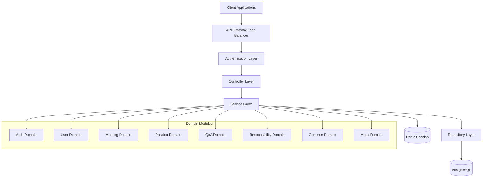
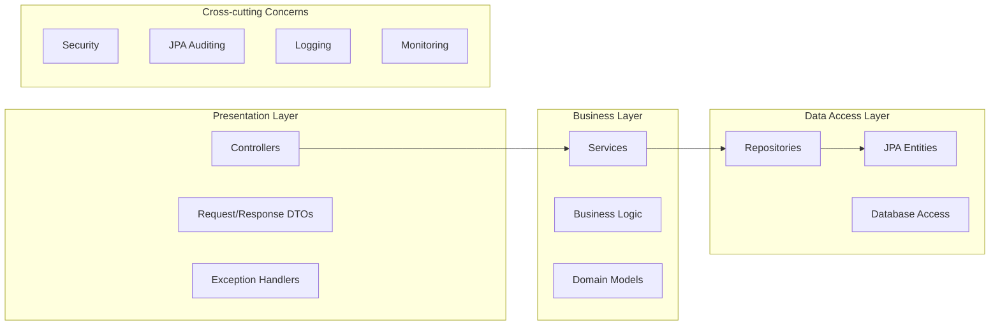
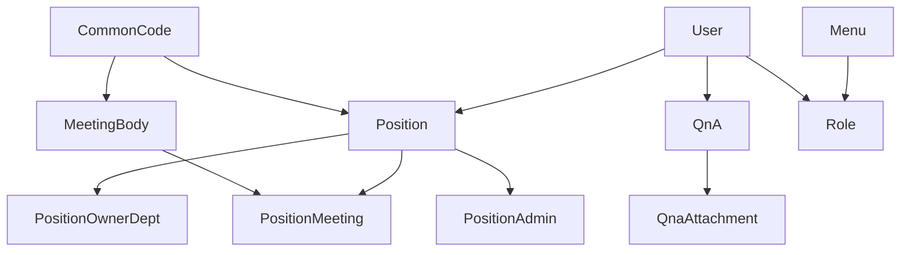
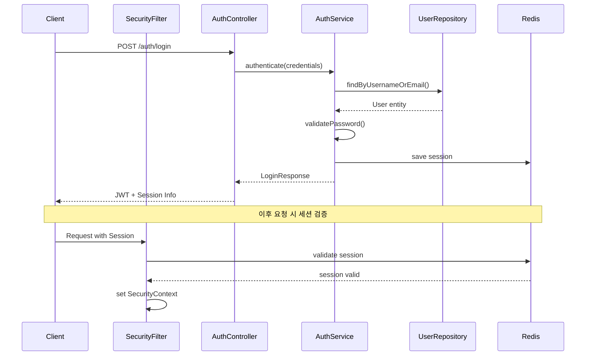
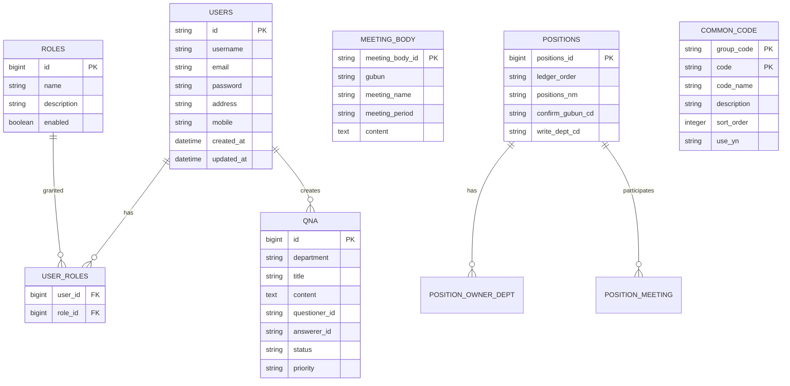

# ITCEN Solution - 백엔드 아키텍처 문서

## 목차

1. [프로젝트 개요](#1-프로젝트-개요)
2. [기술 스택](#2-기술-스택)
3. [아키텍처 구조](#3-아키텍처-구조)
4. [도메인 모델](#4-도메인-모델)
5. [보안 아키텍처](#5-보안-아키텍처)
6. [데이터베이스 설계](#6-데이터베이스-설계)
7. [API 설계](#7-api-설계)
8. [공통 모듈](#8-공통-모듈)
9. [성능 및 최적화](#9-성능-및-최적화)
10. [개발 환경 설정](#10-개발-환경-설정)
11. [배포 및 운영](#11-배포-및-운영)
12. [코딩 가이드라인](#12-코딩-가이드라인)
13. [트러블슈팅](#13-트러블슈팅)

---

## 1. 프로젝트 개요

### 1.1 프로젝트 소개

ITCEN Solution Backend는 Spring Boot 3.5와 Java 21을 기반으로 한 엔터프라이즈급 웹 애플리케이션 백엔드입니다. Domain-Driven Design(DDD) 패턴을 적용하여 확장 가능하고 유지보수가 용이한 구조로 설계되었습니다.

### 1.2 주요 특징

- **최신 기술 스택**: Spring Boot 3.5, Java 21, PostgreSQL, Redis
- **도메인 중심 설계**: DDD 패턴 적용으로 비즈니스 로직 중심 구조
- **강력한 보안**: Spring Security 기반 세션 인증 및 권한 관리
- **확장 가능한 아키텍처**: 마이크로서비스 전환 가능한 모듈화 구조
- **자동화된 관리**: JPA Auditing을 통한 생성/수정 정보 자동 관리

### 1.3 비즈니스 도메인

- **사용자 관리**: 회원가입, 인증, 권한 관리
- **회의체 관리**: 조직의 회의체 정보 및 운영 관리
- **직책 관리**: 조직 내 직책 및 책임 관리
- **Q&A 시스템**: 질의응답 및 지식 관리
- **책무 관리**: 업무 책임 및 관련 근거 관리
- **공통코드 관리**: 시스템 전반의 코드 관리
- **메뉴 관리**: 시스템 메뉴 및 권한 관리

---

## 2. 기술 스택

### 2.1 핵심 프레임워크

| 기술            | 버전  | 용도              |
| --------------- | ----- | ----------------- |
| Spring Boot     | 3.5.0 | 백엔드 프레임워크 |
| Java            | 21    | 프로그래밍 언어   |
| Spring Security | 6.x   | 보안 및 인증      |
| Spring Data JPA | 3.x   | 데이터 액세스     |
| Spring Session  | 3.x   | 세션 관리         |

### 2.2 데이터베이스

| 기술       | 용도              | 환경                |
| ---------- | ----------------- | ------------------- |
| PostgreSQL | 메인 데이터베이스 | 모든 환경           |
| Redis      | 세션 저장소       | Local, Docker, Prod |
| Hibernate  | ORM               | JPA 구현체          |

### 2.3 개발 도구

| 도구                 | 버전   | 용도                |
| -------------------- | ------ | ------------------- |
| Gradle               | 8.x    | 빌드 도구           |
| Lombok               | Latest | 보일러플레이트 제거 |
| Spring Boot DevTools | 3.5.0  | 개발 생산성         |
| Spring Boot Actuator | 3.5.0  | 모니터링            |

---

## 3. 아키텍처 구조

### 3.1 전체 아키텍처



### 3.2 계층별 아키텍처



### 3.3 Domain-Driven Design 구조

```
backend/src/main/java/org/itcen/
├── auth/                    # 인증/인가 도메인
│   ├── config/             # 보안 설정
│   ├── controller/         # 인증 API
│   ├── domain/            # 인증 DTO
│   ├── filter/            # 보안 필터
│   ├── handler/           # 인증 핸들러
│   ├── repository/        # 인증 데이터 액세스
│   ├── service/           # 인증 비즈니스 로직
│   └── session/           # 세션 관리
├── common/                 # 공통 모듈
│   ├── dto/               # 공통 DTO
│   ├── entity/            # 공통 엔티티
│   └── exception/         # 예외 처리
├── config/                 # 전역 설정
├── domain/                 # 비즈니스 도메인
│   ├── casestudy/         # 사례 연구 도메인
│   ├── common/            # 공통코드 도메인
│   ├── meeting/           # 회의체 도메인
│   ├── menu/              # 메뉴 도메인
│   ├── positions/         # 직책 도메인
│   ├── qna/               # Q&A 도메인
│   ├── responsibility/    # 책무 도메인
│   └── user/              # 사용자 도메인
└── finance/               # 메인 애플리케이션
```

---

## 4. 도메인 모델

### 4.1 도메인 구조 개요

각 도메인은 다음과 같은 표준 구조를 따릅니다:

```
domain/{도메인명}/
├── controller/         # REST API 엔드포인트
├── dto/               # 데이터 전송 객체
├── entity/            # JPA 엔티티
├── repository/        # 데이터 액세스 계층
└── service/           # 비즈니스 로직
```

### 4.2 주요 도메인 분석

#### 4.2.1 Auth 도메인 (인증/인가)

```java
// 핵심 기능
- 사용자 인증 (로그인/로그아웃)
- 세션 관리
- 권한 검증
- 비밀번호 관리

// 주요 엔티티
- Role: 역할 정보
- 사용자 권한 매핑

// API 엔드포인트
POST /auth/login        # 로그인
POST /auth/logout       # 로그아웃
POST /auth/signup       # 회원가입
GET  /auth/me          # 현재 사용자 정보
PUT  /auth/password    # 비밀번호 변경
```

#### 4.2.2 Meeting 도메인 (회의체 관리)

```java
// 핵심 기능
- 회의체 생성/수정/삭제
- 회의체 검색 및 조회
- 회의체 분류 관리

// 주요 엔티티
- MeetingBody: 회의체 정보

// API 엔드포인트
POST   /meeting-bodies           # 회의체 생성
GET    /meeting-bodies           # 회의체 목록 조회
GET    /meeting-bodies/{id}      # 회의체 상세 조회
PUT    /meeting-bodies/{id}      # 회의체 수정
DELETE /meeting-bodies/{id}      # 회의체 삭제
GET    /meeting-bodies/search    # 회의체 검색
```

#### 4.2.3 Positions 도메인 (직책 관리)

```java
// 핵심 기능
- 직책 생성/수정/삭제
- 직책-부서 매핑 관리
- 직책-회의체 매핑 관리
- 직책 이력 관리

// 주요 엔티티
- Position: 직책 정보
- PositionOwnerDept: 직책-소관부서 매핑
- PositionMeeting: 직책-회의체 매핑
- PositionAdmin: 직책-관리자 매핑
- PositionHist: 직책 이력

// API 엔드포인트
POST   /positions              # 직책 생성
GET    /positions/status-list  # 직책 현황 조회
GET    /positions/{id}         # 직책 상세 조회
PUT    /positions/{id}         # 직책 수정
DELETE /positions/bulk-delete  # 직책 일괄 삭제
```

#### 4.2.4 QnA 도메인 (질의응답)

```java
// 핵심 기능
- Q&A 생성/수정/삭제
- 답변 관리
- 첨부파일 관리
- 통계 및 분석

// 주요 엔티티
- Qna: Q&A 정보
- QnaAttachment: 첨부파일
- QnaStatus: 상태 (PENDING, ANSWERED, CLOSED)
- QnaPriority: 우선순위 (HIGH, NORMAL, LOW)

// API 엔드포인트
POST   /qna                    # Q&A 생성
GET    /qna                    # Q&A 목록 조회
GET    /qna/{id}               # Q&A 상세 조회
PUT    /qna/{id}               # Q&A 수정
DELETE /qna/{id}               # Q&A 삭제
POST   /qna/{id}/answer        # 답변 등록
PUT    /qna/{id}/answer        # 답변 수정
```

#### 4.2.5 Common 도메인 (공통코드)

```java
// 핵심 기능
- 공통코드 관리
- 그룹별 코드 관리
- 코드 활성화/비활성화

// 주요 엔티티
- CommonCode: 공통코드 정보
- CommonCodeId: 복합키 (groupCode + code)

// API 엔드포인트
GET    /common-codes           # 전체 공통코드 조회
GET    /common-codes/group/{groupCode}  # 그룹별 조회
POST   /common-codes           # 공통코드 생성
PUT    /common-codes/{groupCode}/{code}/activate    # 활성화
PUT    /common-codes/{groupCode}/{code}/deactivate  # 비활성화
```

### 4.3 도메인 간 관계



---

## 5. 보안 아키텍처

### 5.1 인증 및 인가 구조



### 5.2 보안 설정 구조

#### 5.2.1 Spring Security 설정

```java
@Configuration
@EnableWebSecurity
@EnableMethodSecurity(prePostEnabled = true)
public class SecurityConfig {

    // 세션 기반 인증
    // BCrypt 비밀번호 암호화 (strength 12)
    // CORS 설정
    // 접근 권한 매트릭스
    // 예외 처리
}
```

#### 5.2.2 인증 흐름

1. **로그인 요청**: POST /auth/login
2. **사용자 검증**: 사용자명/이메일 + 비밀번호
3. **세션 생성**: Redis에 세션 정보 저장
4. **응답**: 세션 ID + 사용자 정보
5. **후속 요청**: 세션 ID로 인증 상태 확인

#### 5.2.3 권한 관리

```java
// 메서드 레벨 보안
@PreAuthorize("isAuthenticated()")
@PreAuthorize("hasRole('ADMIN')")

// URL 레벨 보안
.requestMatchers("/auth/**").permitAll()
.requestMatchers("/admin/**").hasRole("ADMIN")
.anyRequest().authenticated()
```

### 5.3 세션 관리

#### 5.3.1 Redis 세션 저장소

```yaml
spring:
  session:
    store-type: redis
    redis:
      flush-mode: on_save
      namespace: 'itcen:session'
    timeout: 3600 # 1시간
```

#### 5.3.2 세션 정책

- **세션 타임아웃**: 1시간
- **동시 세션**: 1개 제한
- **세션 갱신**: 요청 시 자동 갱신
- **세션 무효화**: 로그아웃 시 즉시 무효화

---

## 6. 데이터베이스 설계

### 6.1 데이터베이스 아키텍처



### 6.2 주요 테이블 설계

#### 6.2.1 사용자 관리

```sql
-- 사용자 테이블
CREATE TABLE users (
    id VARCHAR(100) PRIMARY KEY,
    username VARCHAR(100) UNIQUE NOT NULL,
    email VARCHAR(100) UNIQUE NOT NULL,
    password VARCHAR(255) NOT NULL,
    address VARCHAR(255),
    mobile VARCHAR(20),
    created_at TIMESTAMP DEFAULT CURRENT_TIMESTAMP,
    updated_at TIMESTAMP DEFAULT CURRENT_TIMESTAMP
);

-- 역할 테이블
CREATE TABLE roles (
    id BIGSERIAL PRIMARY KEY,
    name VARCHAR(50) UNIQUE NOT NULL,
    description VARCHAR(255),
    enabled BOOLEAN DEFAULT true
);
```

#### 6.2.2 회의체 관리

```sql
CREATE TABLE meeting_body (
    meeting_body_id VARCHAR(100) PRIMARY KEY,
    gubun VARCHAR(100) NOT NULL,
    meeting_name VARCHAR(500) NOT NULL,
    meeting_period VARCHAR(10) NOT NULL,
    content TEXT,
    created_at TIMESTAMP DEFAULT CURRENT_TIMESTAMP,
    updated_at TIMESTAMP DEFAULT CURRENT_TIMESTAMP
);
```

#### 6.2.3 공통코드 관리

```sql
CREATE TABLE common_code (
    group_code VARCHAR(50) NOT NULL,
    code VARCHAR(50) NOT NULL,
    code_name VARCHAR(100) NOT NULL,
    description VARCHAR(255),
    sort_order INTEGER DEFAULT 0,
    use_yn CHAR(1) DEFAULT 'Y',
    PRIMARY KEY (group_code, code)
);
```

### 6.3 JPA Auditing

모든 엔티티는 `BaseEntity`를 상속받아 자동으로 생성/수정 정보가 관리됩니다:

```java
@MappedSuperclass
@EntityListeners(AuditingEntityListener.class)
public abstract class BaseEntity {
    @CreatedDate
    private LocalDateTime createdAt;

    @LastModifiedDate
    private LocalDateTime updatedAt;

    private String createdId;
    private String updatedId;
}
```

---

## 7. API 설계

### 7.1 RESTful API 원칙

#### 7.1.1 URL 설계 규칙

```
GET    /api/resource          # 목록 조회
POST   /api/resource          # 생성
GET    /api/resource/{id}     # 상세 조회
PUT    /api/resource/{id}     # 전체 수정
PATCH  /api/resource/{id}     # 부분 수정
DELETE /api/resource/{id}     # 삭제
```

#### 7.1.2 HTTP 상태 코드

- `200 OK`: 성공적인 GET, PUT, PATCH 요청
- `201 Created`: 성공적인 POST 요청
- `204 No Content`: 성공적인 DELETE 요청
- `400 Bad Request`: 잘못된 요청 (유효성 검증 실패)
- `401 Unauthorized`: 인증 필요
- `403 Forbidden`: 권한 없음
- `404 Not Found`: 리소스 없음
- `500 Internal Server Error`: 서버 오류

### 7.2 공통 응답 형식

모든 API는 `ApiResponse<T>` 형식으로 응답합니다:

```json
{
  "success": true,
  "message": "요청이 성공적으로 처리되었습니다.",
  "data": {
    // 실제 데이터
  },
  "error": null,
  "timestamp": "2025-01-20 10:30:00"
}
```

### 7.3 API 인증 및 권한

#### 7.3.1 인증 방식

- **세션 기반 인증**: 쿠키를 통한 세션 ID 전달
- **세션 저장소**: Redis
- **세션 타임아웃**: 1시간

#### 7.3.2 권한 레벨

```java
// 공개 접근
@RequestMapping("/auth/**")

// 인증 필요
@PreAuthorize("isAuthenticated()")

// 관리자 권한
@PreAuthorize("hasRole('ADMIN')")

// 작성자 본인
@PreAuthorize("@qnaService.canEditQna(#id, authentication.name)")
```

### 7.4 API 문서화

Spring Boot Actuator를 통한 API 정보 제공:

- `/actuator/health`: 애플리케이션 상태
- `/actuator/info`: 애플리케이션 정보
- `/actuator/metrics`: 메트릭 정보

---

## 8. 공통 모듈

### 8.1 BaseEntity

모든 엔티티의 기본 클래스로, 공통 속성을 관리합니다:

```java
@MappedSuperclass
@EntityListeners(AuditingEntityListener.class)
public abstract class BaseEntity {
    @CreatedDate
    private LocalDateTime createdAt;

    @LastModifiedDate
    private LocalDateTime updatedAt;

    private String createdId;
    private String updatedId;
}
```

### 8.2 ApiResponse

일관된 API 응답 형식을 제공합니다:

```java
@Builder
@JsonInclude(JsonInclude.Include.NON_NULL)
public class ApiResponse<T> {
    private boolean success;
    private String message;
    private T data;
    private ErrorInfo error;
    private LocalDateTime timestamp;
}
```

### 8.3 GlobalExceptionHandler

전역 예외 처리를 담당합니다:

```java
@RestControllerAdvice
public class GlobalExceptionHandler {
    // Validation 오류 처리
    @ExceptionHandler(MethodArgumentNotValidException.class)

    // 비즈니스 오류 처리
    @ExceptionHandler(BusinessException.class)

    // 시스템 오류 처리
    @ExceptionHandler(Exception.class)
}
```

### 8.4 BusinessException

비즈니스 로직 오류를 위한 커스텀 예외:

```java
public class BusinessException extends RuntimeException {
    private final String errorCode;

    public BusinessException(String message, String errorCode) {
        super(message);
        this.errorCode = errorCode;
    }
}
```

---

## 9. 성능 및 최적화

### 9.1 JPA 최적화

#### 9.1.1 연관관계 최적화

```java
// 지연 로딩 사용
@ManyToOne(fetch = FetchType.LAZY)

// N+1 문제 해결
@Query("SELECT m FROM Meeting m JOIN FETCH m.participants")

// 배치 크기 설정
spring.jpa.properties.hibernate.jdbc.batch_size=20
```

#### 9.1.2 쿼리 최적화

```java
// 페이징 처리
Page<Entity> findAll(Pageable pageable);

// 동적 쿼리
@Query("SELECT e FROM Entity e WHERE " +
       "(:param IS NULL OR e.field = :param)")

// 프로젝션 사용
interface ProjectionInterface {
    String getField1();
    String getField2();
}
```

### 9.2 캐싱 전략

#### 9.2.1 Redis 캐싱

```java
// 세션 캐싱
@EnableRedisHttpSession(maxInactiveIntervalInSeconds = 3600)

// 데이터 캐싱 (향후 확장)
@Cacheable("commonCodes")
@CacheEvict("commonCodes")
```

### 9.3 데이터베이스 최적화

#### 9.3.1 인덱스 설정

```sql
-- 자주 검색되는 컬럼에 인덱스
CREATE INDEX idx_users_username ON users(username);
CREATE INDEX idx_users_email ON users(email);
CREATE INDEX idx_qna_department ON qna(department);
CREATE INDEX idx_qna_status ON qna(status);
```

#### 9.3.2 커넥션 풀 설정

```yaml
spring:
  datasource:
    hikari:
      maximum-pool-size: 20
      minimum-idle: 10
      connection-timeout: 20000
      idle-timeout: 300000
      max-lifetime: 1200000
```

---

## 10. 개발 환경 설정

### 10.1 프로파일별 설정

#### 10.1.1 Local 환경

```yaml
spring:
  profiles:
    active: local
  datasource:
    url: jdbc:postgresql://localhost:5432/dev_db
  data:
    redis:
      host: localhost
      port: 6379
```

#### 10.1.2 Docker 환경

```yaml
spring:
  profiles:
    active: docker
  datasource:
    url: jdbc:postgresql://postgres:5432/postgres
  data:
    redis:
      host: redis
      port: 6379
```

### 10.2 개발 도구 설정

#### 10.2.1 Spring Boot DevTools

```yaml
spring:
  devtools:
    livereload:
      enabled: false
    restart:
      enabled: true
      additional-paths: src/main/java
```

#### 10.2.2 로깅 설정

```yaml
logging:
  level:
    org.hibernate.SQL: DEBUG
    org.hibernate.type.descriptor.sql.BasicBinder: TRACE
    org.itcen: DEBUG
```

### 10.3 데이터베이스 초기화

#### 10.3.1 DDL 스크립트

```sql
-- database/init/01_create_users_table.sql
-- database/init/02_insert_test_data.sql
-- database/init/03_create_menu_table.sql
-- database/init/04_create_qna_table.sql
-- database/init/05_create_common_code_table.sql
```

---

## 11. 배포 및 운영

### 11.1 Docker 설정

#### 11.1.1 Dockerfile

```dockerfile
FROM openjdk:21-jdk-slim
COPY build/libs/*.jar app.jar
EXPOSE 8080
ENTRYPOINT ["java", "-jar", "/app.jar"]
```

#### 11.1.2 Docker Compose

```yaml
version: '3.8'
services:
  backend:
    build: .
    ports:
      - '8080:8080'
    depends_on:
      - postgres
      - redis
    environment:
      SPRING_PROFILES_ACTIVE: docker
```

### 11.2 모니터링

#### 11.2.1 Spring Boot Actuator

```yaml
management:
  endpoints:
    web:
      exposure:
        include: health,info,metrics,prometheus
  endpoint:
    health:
      show-details: always
```

#### 11.2.2 헬스 체크

- `/actuator/health`: 애플리케이션 상태
- `/actuator/health/db`: 데이터베이스 연결 상태
- `/actuator/health/redis`: Redis 연결 상태

### 11.3 보안 설정

#### 11.3.1 운영 환경 보안

```yaml
# 프로덕션 환경에서는 다음 설정 적용
spring:
  jpa:
    show-sql: false
    hibernate:
      ddl-auto: validate

logging:
  level:
    org.hibernate.SQL: WARN
    org.springframework.security: WARN
```

---

## 12. 코딩 가이드라인

### 12.1 Java 코딩 규칙

#### 12.1.1 명명 규칙

```java
// 클래스: PascalCase
public class UserService { }

// 메서드/변수: camelCase
public void getUserById(Long userId) { }

// 상수: UPPER_SNAKE_CASE
public static final String DEFAULT_ROLE = "USER";

// 패키지: lowercase
package org.itcen.domain.user.service;
```

#### 12.1.2 SOLID 원칙 적용

```java
// Single Responsibility: 단일 책임
@Service
public class UserService {
    // 사용자 관련 비즈니스 로직만 담당
}

// Dependency Inversion: 의존성 역전
@RequiredArgsConstructor
public class UserService {
    private final UserRepository userRepository; // 인터페이스 의존
}
```

### 12.2 Spring Boot 규칙

#### 12.2.1 애너테이션 사용

```java
// 계층별 애너테이션
@RestController  // REST API 컨트롤러
@Service        // 비즈니스 로직
@Repository     // 데이터 액세스
@Configuration  // 설정 클래스

// 유효성 검증
@Valid @RequestBody UserCreateDto request

// 보안
@PreAuthorize("isAuthenticated()")
```

#### 12.2.2 예외 처리

```java
// 비즈니스 예외
throw new BusinessException("사용자를 찾을 수 없습니다.", "USER_NOT_FOUND");

// 전역 예외 처리
@ExceptionHandler(BusinessException.class)
public ResponseEntity<ApiResponse<Object>> handleBusinessException(BusinessException e) {
    return ResponseEntity.badRequest()
        .body(ApiResponse.error(e.getMessage(), e.getErrorCode()));
}
```

### 12.3 JPA 규칙

#### 12.3.1 엔티티 설계

```java
@Entity
@Table(name = "users")
@Data
@EqualsAndHashCode(callSuper = true)
@Builder
@NoArgsConstructor
@AllArgsConstructor
public class User extends BaseEntity {
    @Id
    private String id;

    @Column(unique = true, nullable = false)
    private String username;
}
```

#### 12.3.2 Repository 설계

```java
@Repository
public interface UserRepository extends JpaRepository<User, String> {
    Optional<User> findByUsername(String username);

    @Query("SELECT u FROM User u WHERE u.email = :email")
    Optional<User> findByEmail(@Param("email") String email);
}
```

---

## 13. 트러블슈팅

### 13.1 일반적인 문제 해결

#### 13.1.1 데이터베이스 연결 오류

```bash
# 문제: PostgreSQL 연결 실패
# 해결: 데이터베이스 상태 확인
docker ps | grep postgres
docker logs postgres_container

# 연결 정보 확인
spring.datasource.url=jdbc:postgresql://localhost:5432/dev_db
spring.datasource.username=postgres
spring.datasource.password=1q2w3e4r!
```

#### 13.1.2 Redis 연결 오류

```bash
# 문제: Redis 연결 실패
# 해결: Redis 서버 상태 확인
redis-cli ping

# 설정 확인
spring.data.redis.host=localhost
spring.data.redis.port=6379
```

#### 13.1.3 세션 인증 문제

```java
// 문제: 세션 인증 실패
// 해결: SecurityContext 확인
Authentication auth = SecurityContextHolder.getContext().getAuthentication();
if (auth == null || !auth.isAuthenticated()) {
    // 인증 정보 없음
}

// 세션 정보 확인
HttpSession session = request.getSession(false);
if (session == null) {
    // 세션 없음
}
```

### 13.2 성능 문제 해결

#### 13.2.1 N+1 쿼리 문제

```java
// 문제: 연관관계에서 N+1 쿼리 발생
// 해결: JOIN FETCH 사용
@Query("SELECT m FROM Meeting m JOIN FETCH m.participants WHERE m.id = :id")
Optional<Meeting> findByIdWithParticipants(@Param("id") Long id);
```

#### 13.2.2 메모리 누수

```java
// 문제: 세션 메모리 누수
// 해결: 세션 타임아웃 설정
spring.session.timeout=3600

// 미사용 세션 정리
@Scheduled(fixedRate = 3600000) // 1시간마다
public void cleanupExpiredSessions() {
    // 만료된 세션 정리 로직
}
```

### 13.3 로깅 및 디버깅

#### 13.3.1 SQL 로깅

```yaml
logging:
  level:
    org.hibernate.SQL: DEBUG
    org.hibernate.type.descriptor.sql.BasicBinder: TRACE
```

#### 13.3.2 보안 로깅

```yaml
logging:
  level:
    org.springframework.security: DEBUG
```

#### 13.3.3 애플리케이션 로깅

```java
@Slf4j
@Service
public class UserService {
    public User createUser(UserCreateDto dto) {
        log.info("Creating user: {}", dto.getUsername());
        try {
            // 사용자 생성 로직
            log.info("User created successfully: {}", user.getId());
            return user;
        } catch (Exception e) {
            log.error("Failed to create user: {}", dto.getUsername(), e);
            throw e;
        }
    }
}
```

---

## 변경 이력

### 1.0.0 (2025.01)

- 초기 백엔드 아키텍처 문서 작성
- Spring Boot 3.5 + Java 21 기반 구조 문서화
- DDD 아키텍처 및 8개 도메인 모델 분석
- 보안 아키텍처 및 세션 기반 인증 체계 문서화
- 데이터베이스 설계 및 JPA 엔티티 구조 분석
- RESTful API 설계 원칙 및 공통 응답 형식 정의
- 성능 최적화 및 개발 가이드라인 작성

---

**문서 정보**

- 작성자: ITCEN Solution Team
- 문서 버전: 1.0.0
- 최종 업데이트: 2025년 1월
- 검토주기: 분기별
